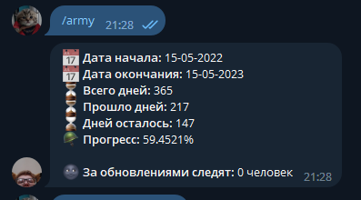
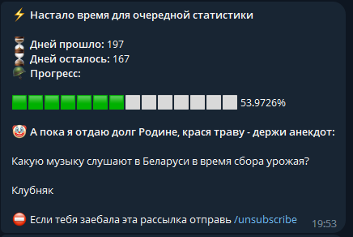

# Army Bot

### Что это такое?

Этот бесполезный бот создан для оповещения о том, сколько мне осталось служить в армии.
(У меня шизофрения)

### Как это работает?

| Вывод статистики по команде | Рассылка статистики подписчикам |
| --------------------------- | ------------------------------- |
|     |         |

### Как это запустить?

```
git clone https://github.com/renardein/army-bot
cd army-bot
npm install
```

Переименовать `.env_example` в `.env` и прописать в него сервисный ключ от приложения [ВКонтакте](https://vk.com/editapp?act=create) и токен бота [Telegram](https://botfather.t.me)

```
node ./index.js
```

### Доступные команды

| Команда                   | Описание                                                                            |
| ------------------------- | ----------------------------------------------------------------------------------- |
| `/start`                  | Вызывает приветствие бота                                                           |
| `/subscribe`              | Подписывает пользователя на рассылку                                                |
| `/unsubscribe`            | Отписывает пользователя от рассылки                                                 |
| `/army`                   | Статистика                                                                          |
| `/set date 01-01-2001`    | Устанавливает дату начала отсчета                                                   |
| `/set mailer 00 12 * * *` | Устанавливает переодичность рассылки (Используется cron)                            |
| `/debug`                  | Выводит время работы скрипта в секундах и объем потребляемой процеcсом памяти (rss) |

### Документация

Я не знаю зачем данному проекту документация, но пускай будет. Стоит помнить что у разработчика шизофрения.<br>

- [Дорожная карта](docs/roadmap.md)
- [Локализация проекта](docs/localization.md)
- Остальное будет дописано по мере обострения болезни

### Демонстрация
[Сам бот находится здесь](https://renardein_bot.t.me). Иногда может прилечь отдохнуть.
