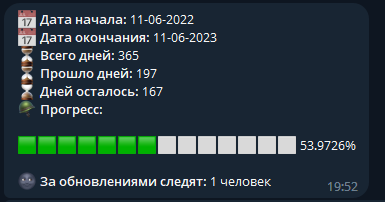

# Army Bot

### Что это такое?

Этот бесполезный бот создан для оповещения о том, сколько мне осталось служить в армии.
(У меня шизофрения)

### Как это работает?

| Вывод статистики по команде | Рассылка статистики подписчикам |
| --------------------------- | ------------------------------- |
|     |         |

### Как это запустить?

```
git clone https://github.com/renardein/army-bot
cd army-bot
npm install
```

Переименовать `.env_example` в `.env` и прописать в него токены от ВКонтакте и Telegram

```
node ./index.js
```

### Доступные команды

| Команда                   | Описание                                                                            |
| ------------------------- | ----------------------------------------------------------------------------------- |
| `/start`                  | Вызывает приветствие бота                                                           |
| `/subscribe`              | Подписывает пользователя на рассылку                                                |
| `/unsubscribe`            | Отписывает пользователя от рассылки                                                 |
| `/army`                   | Статистика                                                                          |
| `/set date 01-01-2001`    | Устанавливает дату начала отсчета                                                   |
| `/set mailer 00 12 * * *` | Устанавливает переодичность рассылки (Используется cron)                            |
| `/debug`                  | Выводит время работы скрипта в секундах и объем потребляемой процеcсом памяти (rss) |

### Документация

Я не знаю зачем данному проекту документация, но пускай будет. Стоит помнить что у разработчика шизофрения.<br>

- [Локализация проекта](assets/docs/localization.md)
- Остальное будет дописано по мере обострения болезни

### Дорожная карта

##### Механизм подписки на обновления

- [x] Возможность подписаться на обновления
- [x] Возможность отписаться от обновлений
- [x] Проверка статуса подписки
- [x] При добавлении бота в чат происходит автоматическая подписка данного чата на рассылку
- [x] При удалении бота из чата происходит автоматическая отписка данного чата
- [x] Если пользователь блокирует бота, то происходит автоматическое удаление пользователя из списка рассылки

##### Mailer

- [x] Таймер рассылки (cronJob)
- [ ] Установка cron-паттерна через команду бота
- [x] Механизм рассылки
- [x] Шаблон сообщения рассылки
- [x] Приколясики в рассылке

##### Счетчики

- [x] Установка даты
- [ ] Рефакторинг механизма установки даты
- [x] Статистика службы (дата начала, дата окончания, дней прошло, дней осталось, прогресс-бар)

##### Разработка

- [ ] Использовать базу данных вместо JSON файла (readiness: 65%)
- [x] Асинхронность
- [ ] Оптимизация?
- [ ] Объеденить некоторые модули, слишком много ООП (readiness: 80%)
- [ ] Обработка ошибок (readiness: 70%)

### Дальнейшие планы

При обострении шизофрении планируется сделать данный проект более глобальным, например с возможностью отслеживания каждым пользователем своего списка солдатиков.
